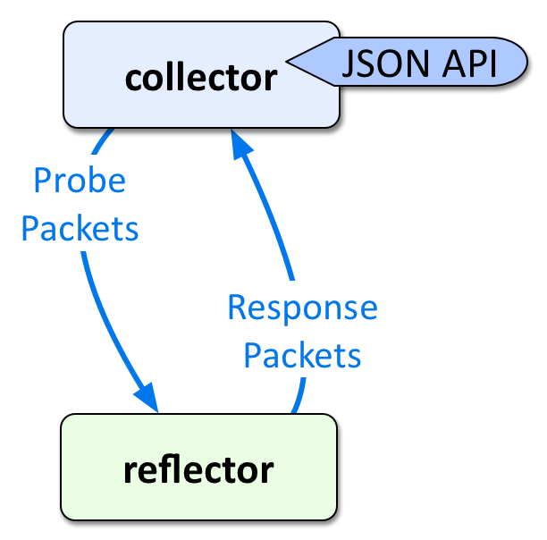

# LLAMA


**LLAMA** is a deployable service which artificially produces
traffic for measuring network performance between endpoints.

LLAMA uses UDP socket level operations to support multiple QoS
classes. UDP datagrams are fast, efficient, and will hash
across ECMP paths in large networks to uncover faults and erring
interfaces. LLAMA is written in pure Python for maintainability.


## Okay, but not yet

LLAMA will eventually have all those capabilities, but not yet.
For instance, there it does not currently provide UDP or QOS
functionality, but will send test traffic using `hping3`
It's currently being tested in *Alpha* at Dropbox through
experimental correlation. See the TODO list below for more plans.


# Problem
Measure the following between groups of endpoints across a network:
* round-trip latency
* packet loss


# Solution

1. A `collector` sends traffic and produces measurements
2. A `reflector` replies to the `collector`
3. A `scraper` places measurements from `collectors` into a TSDB (timeseries database)

|   |  |
| ---- | ---- |


## MVP Design Decisions

In order to built a minimally viable product first, the following decisions were made:

1. Python for maintainability (still uncovering how this will scale)
2. Initially TCP (hping3), then UDP (sockets)
3. InfluxDB for timeseries database
4. Grafana for UI, later custom web UI


## ICMP vs. TCP vs. UDP

* **ICMP:** send echo-request; reflector sends back echo-reply (IP stack handles this natively)
* **TCP:** send `TCP SYN` to `tcp/0`; reflector sends back `TCP RST+ACK`; source port increments (IP stack handles natively)
* **UDP:** send `UDP` datagram to receiving port on reflector; reflector replies; source port increments (relies on Reflector agent)

Sending ICMP pings or sending TCP/UDP traffic all result in different behaviors. ICMP is useful to test reachability but generally not useful for testing multiple ECMP paths in a large or complex network fabric.

TCP can test ECMP paths, but in order to work without a reflector agent, needs to trick the TCP/IP stack on the reflecting host by sending to `tcp/0`. TCP starts breaking down at high transmission volumes because the host fails to respond to some `SYN` packets with `RST+ACK`. However, the approach with TCP fits for an MVP model.

UDP can be supported with a reflector agent which knows how to respond quickly to UDP datagrams. There's no trickery here -- UDP was designed to work 

|      | ICMP | TCP | UDP |
| --- |:---:|:---:|:---:|
| Easy implementation | &#10003; | &#10003; |  |
| Hashes across LACP/ECMP paths | | &#10003; | &#10003; |
| Works without Reflector agent | &#10003; | &#10003; |  |


## Collector Agent

The collector agent is responsible for probing other hosts, or 'reflectors', and exposing the latency and loss measurements. Those measurements are exposed via a very simple JSON API. The data can be presented in the InfluxDB data format for direct ingestion into the timeseries database.

> NOTE: The Collector agent could be easily extended to support other timeseries databases. This could be a great entry point for plugins.


## Collector Configuration

The configuration for each collector is just a simple YAML file, which could be easily generated at scale for larger networks. Each target is comprised of a `hostname` (or IP address) and key=value `tags`. The tags are automatically exposed through the Collector API to later become part of timeseries data.  `src_hostname` and `dst_hostname` are automatically added by the Collector.

```
# LLAMA Collector Config for host: collector01

reflector01:
    rack: 01
    cluster: aa
    datacenter: iad
reflector02:
    rack: 01
    cluster: bb
    datacenter: iad
```


## LLAMA's UDP Support
TBD


# TODO
- [x] Implement MVP product
  - [x] TCP library (using `hping3` in a shell) 
  - [x] Collector agent
  - [x] Scraper agent
  - [x] JSON API for InfluxDB (`/influxdata`)
  - [x] JSON API for generic data (`/latency`)
- [x] Implement UDP library (using sockets)
- [ ] Implement Reflector UDP agent
- [ ] Write bin runscripts for UDP Sender/Reflector CLI utilities
- [ ] Integrate Travis CI tests
- [ ] Hook UDP library into Collector process
- [ ] Add support for QOS
- [ ] Add monitoring timeseries for Collectors
- [ ] Write matrix-like UI for InfluxDB timeseries
- [ ] Document timeseries aggregation to pinpoint loss


# Acknowledgements / References

* Inspired by: https://www.youtube.com/watch?v=N0lZrJVdI9A
  * with slides: https://www.nanog.org/sites/default/files/Lapukhov_Move_Fast_Unbreak.pdf
* Concepts borrowed from: https://github.com/facebook/UdpPinger/
